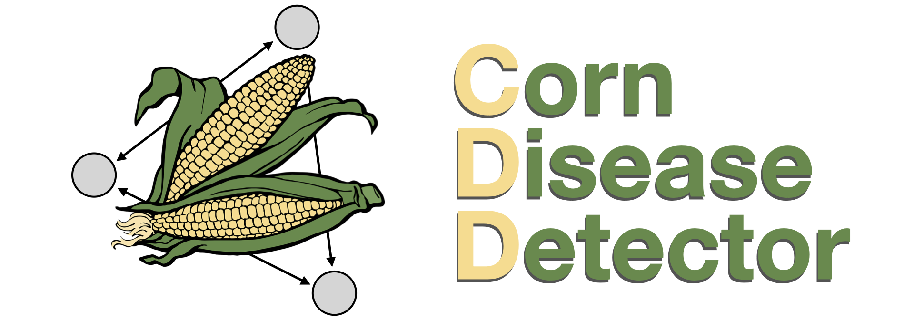

# Corn Disease Detector (CDD) Project

**Authors:** Juan Zurita, [Sebastián Ayala Ruano](https://sayalaruano.github.io/), Ximena Celi, Gilberto Rodríguez.   

This is the repository for CDD, an **early plant disease detector** based on **convolutional neural networks**, trained to recognize two types of maize infectious diseases: Common rust of corn and Northern corn leaf blight. The `Transfer Learning` strategy was applied due to the absence of large image datasets of corn diseases. The main library used to build our model was [`Pytorch`](https://pytorch.org/). This project was built during the [Saturdays AI Quito 2021](https://quito.saturdays.ai) artificial intelligence workshop. 

The complete information regarding datasets, model, performance metrics, a web application to test CDD, a jupyter notebook of reference to reproduce our work, and further details are available at our [GitHub Page](https://corndiseasedetector.github.io).

## Acknowledgments

Special thanks to [Will Koehrsen](https://github.com/WillKoehrsen) for providing a [reference jupyter notebook](https://github.com/WillKoehrsen/pytorch_challenge/blob/master/Transfer%20Learning%20in%20PyTorch.ipynb) of Transfer Learning in PyTorch tasks, which we took as the starting point for our work. Also, thanks to [PlantVillage](https://plantvillage.psu.edu/) initiative to provide the data used to train our model. 
