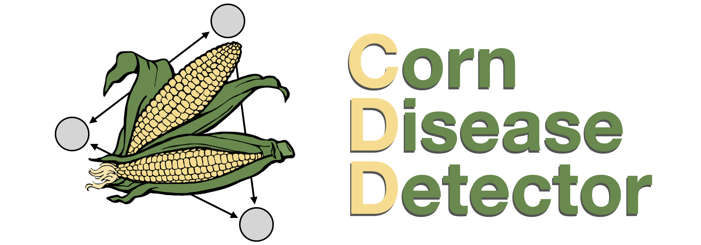

## Welcome to CDD Main Page



Infectious diseases are a `major threat` to many crops of high importance for the food secutiry of many regions of the world. Each year, around 60% of farmers in Ecuador have reported `pre-harvest losses` due to infectious agents such as fungi and bacteria, in crops like banana, cacao and potato. Outbreaks of infection could endager the country's economy and cause many people to loose their jobs. This project is an effort to develop an `early plant disease detector` as a *proof of concept*, using [publicly available datasets of maize](https://data.mendeley.com/datasets/tywbtsjrjv/1). In the future, we plan to expand this project to cover other important farming ecuadorian species. 

## About our model

Our model is a classifier based on **convolutional neural networks**, trained to recognize two types of maize infectious diseases: Common rust of corn and Northern corn leaf blight. The available datasets for maize are too small to be used in deep neural networks. To solve this problem we used a `Transfer Learning` strategy and reused some layers from a ResNet50 neural network trained on the [`ImageNet dataset`](https://www.image-net.org/), from [`torchvision.models.resnet50`](https://pytorch.org/vision/stable/_modules/torchvision/models/resnet.html). In this way, general image patterns are identified by pre-trained layers, and we trained additional layers of the network to identify healthy and diseased corn images. This network architecture has shown very promissing results in [previous studies](https://plantmethods.biomedcentral.com/articles/10.1186/s13007-019-0475-z) of computer vision for agriculture. 

## Model Performance

The loss and accuracy of training and validation datasets are shown below:


### Run the Streamlit app
In case you just want to run the app, you could do it directly from our **repository**. First, download the requirements file in the `main branch` and install all the requirements in a new Python environmnet. 


Now, copy this URL [https://github.com/corndiseasedetector/corndiseasedetector.github.io/blob/main/webapp.py](https://github.com/corndiseasedetector/corndiseasedetector.github.io/blob/main/webapp.py), that points to our Streamlit script. Store an image of . Go to a folder .


### Replicate our work

If you wish to replicate our work, please download our `jupyter notebook`, or better clone this whole repository. We trained our NN using Google Cloud GPUs, so you could also make a [`copy of the notebook`](https://drive.google.com/file/d/1IJNLBUoJIQpNhsha8eOib3POjOzjsd1M/view?usp=sharing) to your Google Drive, or you can use your resources locally:
```bash
$ git clone https://github.com/corndiseasedetector/corndiseasedetector.github.io
$ cd corndiseasedetector.github.io
```

We created a requirements file which have all the Python libraries you will need to replicate this work. Please, consider creating a **`separate virtual environment`** to prevent version conflicts with your personal projects. If you use `pyenv` on a Mac or a Linux computer, use these commands in a Terminal window: 
```bash
$ pyenv virtualenv 
```

## Support or Contact

If you have any request of trouble using our model, please contact us to out email `ai2021grupo7[at]gmail.com`.
